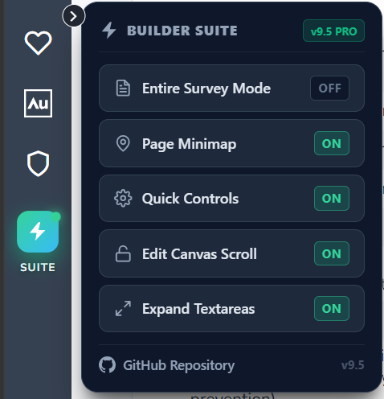
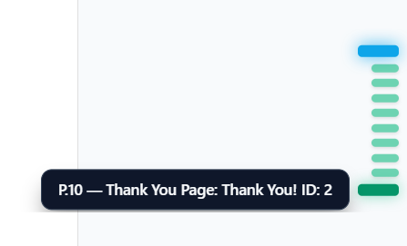
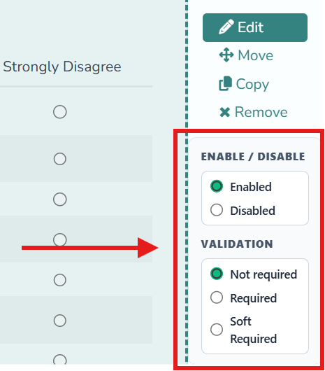
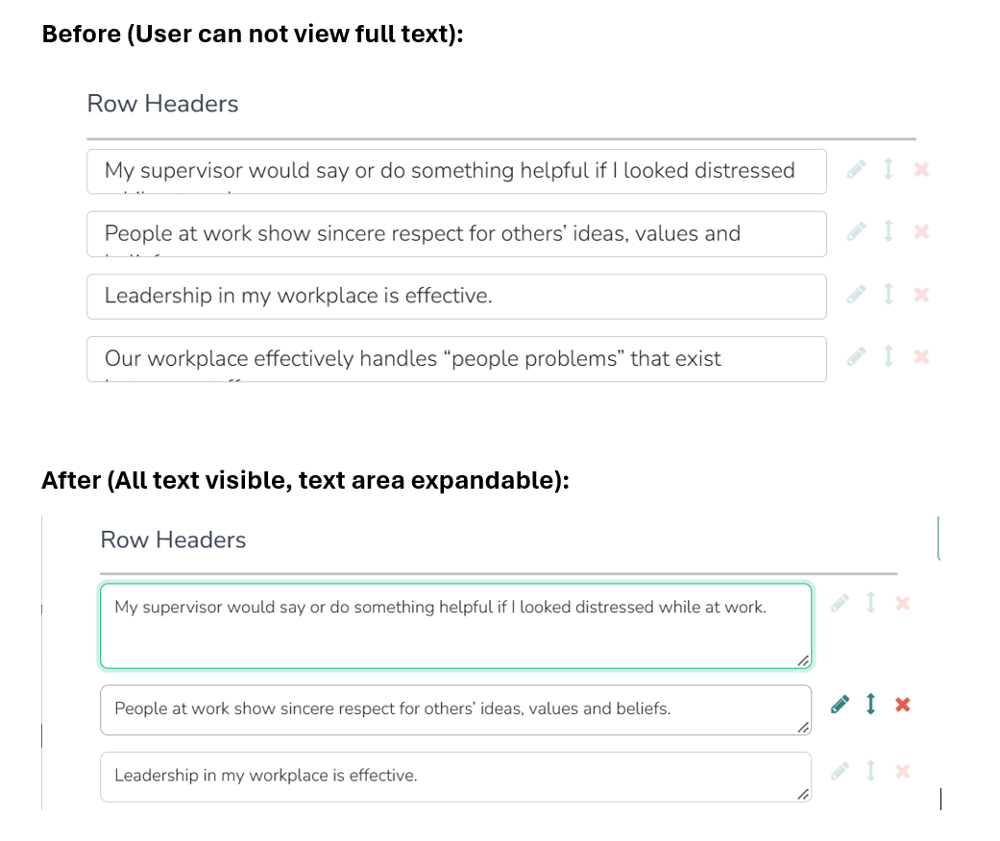

<div align="center">


### Alchemer Builder Power Suite

**Power tools that make building surveys in the [Alchemer](https://www.alchemer.com/) Builder faster and less frustrating.**

A Tampermonkey userscript that lives right in your **Alchemer side navigation bar** and opens a dark, SaaS-style control panel — one-page survey mode, an auto-highlighting page minimap, inline quick controls, expandable textareas, and canvas scroll unlocking — all directly inside the Alchemer survey builder.

[](https://github.com/jenishmangukiya/alchemer-builder-power-suite)
[](https://www.alchemer.com/)
[](https://www.tampermonkey.net/)
[](#-credits)

</div>

---

<div align="center">



**The ⚡ SUITE item in your sidebar opens the Builder Suite control panel.**

</div>

---

## 🧭 What is this?

[Alchemer](https://www.alchemer.com/) is a powerful, enterprise-grade online survey and data-collection platform (formerly **SurveyGizmo**). Its **Builder** is where you create and edit surveys — but the default editor can be fiddly: you bounce between pages, lose your place in long surveys, and fight with locked scroll while editing.

**Alchemer Builder Power Suite** is a lightweight userscript that layers a set of productivity tools directly into the Builder's own sidebar. It does **not** change your survey data — it only improves the editing experience in your browser.

> ⚠️ This is a third-party community tool. It is **not affiliated with, endorsed by, or sponsored by Alchemer**.

---

## 🚀 Installation

1. Install the [Tampermonkey extension](https://www.tampermonkey.net/) for your browser.
2. **[Click here to install Alchemer Builder Power Suite](https://raw.githubusercontent.com/jenishmangukiya/alchemer-builder-power-suite/main/alchemer-builder-power-suite.user.js)**
3. Click **Install** when the Tampermonkey prompt opens.
4. Open any Alchemer survey in the **Builder** — a glowing **SUITE** item appears in the left navigation bar.

> **Note:** Updates are automatic! Tampermonkey periodically checks this repository and installs new versions when available.

---

## ✨ Features

| Feature | What it does |
| --- | --- |
| **🧭 Built into the Side Nav** | Adds a glowing **SUITE** item to Alchemer's own left navigation, complete with a gradient icon and a pulsing live beacon. Easy to spot and always within reach — no floating widget to chase around the screen. |
| **🪟 Builder Suite Panel** | A polished dark popover card (`v9.5 PRO`) that anchors beside the nav item, auto-clamps to stay on screen at any window size, and closes when you click away. |
| **📄 Entire Survey Mode** | One click toggles `?c=0&p=0` and renders the whole survey on a single page — click again to return to normal paged mode. |
| **📍 Auto-Highlighting Minimap** | A glass rail of page indicators on the right margin. The page you're currently viewing is highlighted automatically and scrolled into view, with `P.n — title` tooltips on hover. |
| **⚡ Quick Controls** | Turn individual questions on or off right from the question action links, without opening full settings. |
| **📋 Requirement Controls** | Instantly switch a question between **Not required**, **Required**, and **Soft Required** from an inline dropdown. |
| **🔓 Edit Canvas Scroll** | Fixes locked background scrolling while edit panes or modals are open, so you can keep working. |
| **↕️ Expand Textareas** | Auto-growing, vertically resizable textareas in the edit panes, so long labels and option text are easy to read and edit. |

---

## 🖼️ Feature gallery

<div align="center">

### 🧭 Built into the Side Nav


A glowing **SUITE** item in Alchemer's own left nav opens the full control panel — every tool is one click away.

### 📍 Auto-Highlighting Minimap



A glass rail of page dots tracks your position, scrolls the current page into view, and shows `P.n — title` tooltips on hover.

### ⚡ Quick Controls & 📋 Requirement Controls



Toggle a question **on or off** and switch its requirement level (**Not required / Required / Soft Required**) right from the question action links — no full settings pane needed.

### ↕️ Expand Textareas



Long labels and option text auto-grow so you can read and edit the full value without fighting a tiny, locked textarea.

</div>

---

## 🕹️ How to use

1. Find the **⚡ SUITE** item in the Alchemer **left navigation bar** (it has a pulsing green beacon so it's easy to spot).
2. Click it to open the **Builder Suite** flyout panel. It positions itself next to the nav item and stays on screen at any window size.
3. Use the buttons to toggle features on or off — each shows a live **ON / OFF** pill and your choices are saved automatically.
4. Click anywhere outside the panel to close it.

### Builder Suite options

- **📄 Entire Survey Mode** — switch between full-page and paged survey views (`?c=0&p=0`).
- **📍 Page Minimap: ON / OFF** — show or hide the auto-highlighting right-margin page minimap.
- **⚡ Quick Controls: ON / OFF** — enable or disable the inline question on/off switch and requirement dropdown.
- **🔓 Edit Canvas Scroll: ON / OFF** — unlock or lock background scrolling while editing.
- **↕️ Expand Textareas: ON / OFF** — auto-grow and vertically resize textareas in edit panes.

---

## 🧩 Compatibility

- **Browsers:** Chrome, Edge, Firefox, Brave, and any Chromium/Firefox-based browser supported by Tampermonkey.
- **Sites:** Matches the Alchemer Builder on:
  - `https://*.alchemer.com/builder/build*`
  - `https://*.alchemer-ca.com/builder/build*` (Canada)
  - `https://*.surveygizmo.com/builder/build*` (legacy domain)
- **Requirements:** A userscript manager such as [Tampermonkey](https://www.tampermonkey.net/) (or Violentmonkey/Greasemonkey).

---

## 💾 Saved settings

The script remembers your preferences in your browser's `localStorage`:

| Key | Purpose | Default |
| --- | --- | --- |
| `alc_minimap_visible` | Show the page minimap | `false` |
| `alc_quick_disable_enabled` | Enable inline question controls | `true` |
| `alc_scroll_unlocked` | Unlock background canvas scrolling | `true` |
| `alc_expandable_textarea_enabled` | Auto-expand textareas in edit panes | `true` |

---

## 🔒 Security & Privacy

This script is designed to be transparent and safe to run:

- **✅ 100% free** — no cost, no ads, no upsells, no "pro" tier.
- **✅ Open source** — every line is plain, readable JavaScript. You can review the entire script before installing.
- **✅ No data collection** — it runs entirely in your browser. It does **not** phone home, track you, or send any data to third-party servers.
- **✅ No external code** — nothing is downloaded or executed from remote servers at runtime, and there is no `eval` or obfuscated code.
- **✅ Scoped to Alchemer only** — it activates *only* on the Alchemer Builder URLs listed under [Compatibility](#-compatibility), and requests the single `GM_addStyle` permission.
- **✅ Your survey data stays intact** — it only enhances the editor UI; it never modifies, uploads, or stores your survey content.

> **Good practice:** Always review a userscript before installing it, and only install scripts from sources you trust. You can read this one in full right here: [alchemer-builder-power-suite.user.js](alchemer-builder-power-suite.user.js).

---

## ❓ FAQ

**Is it really free?**
Yes. The script is free and open source, with no ads, accounts, or paid features.

**Is it safe? Will it break my surveys?**
It only changes how the Builder looks and behaves in your browser — it does not edit survey data or publish anything. If you ever want to disable it, just turn the script off in Tampermonkey.

**Does it collect any of my data?**
No. There is no analytics, tracking, or network traffic. Your preferences are saved locally in your browser via `localStorage`.

**Where did the old floating button go?**
As of **v9.1**, the suite lives in Alchemer's own left navigation bar as the **SUITE** item — it's easier to reach and no longer overlaps your survey canvas.

**Will it work after Alchemer updates the Builder?**
The script targets stable Builder elements, but major platform UI changes could require an update. Tampermonkey auto-updates from this repository, so you'll get fixes automatically.

**Is this made by Alchemer?**
No. It's an independent, community-built tool and is not affiliated with or endorsed by Alchemer.

---

## 📁 Project files

```
alchemer-builder-power-suite/
├── alchemer-builder-power-suite.user.js   # The Tampermonkey userscript
├── assets/
│   ├── main_tool_left_nav.png             # The SUITE panel in the left navigation bar
│   ├── minimap.png                        # Auto-highlighting page minimap
│   ├── quick_controls.png                 # Inline enable/disable and requirement controls
│   └── textarea_expand.png                # Before/after of expandable textareas
└── README.md                              # This file
```

---

## 🧑‍💻 Credits

- **Author:** Jenish Mangukiya
- **Platform:** Built for the [Alchemer Survey Platform](https://www.alchemer.com/) (formerly SurveyGizmo)
- **Alchemer logo** is a trademark of Alchemer LLC, used here for identification purposes only.

---

<div align="center">

**Alchemer Builder Power Suite** · v9.5.0

Built to make survey building faster ⚡

</div>
